# Projeto `Advanced Store`

# Equipe 2
* Caroline Augusti
* Felipe Emygdio de Salles
* Gustavo Porto Guedes
* Luan Neves Silva
* Paulo Mellin Gimenes
* Thiago Natanael


# Nível 1

## Diagrama Geral do Nível 1

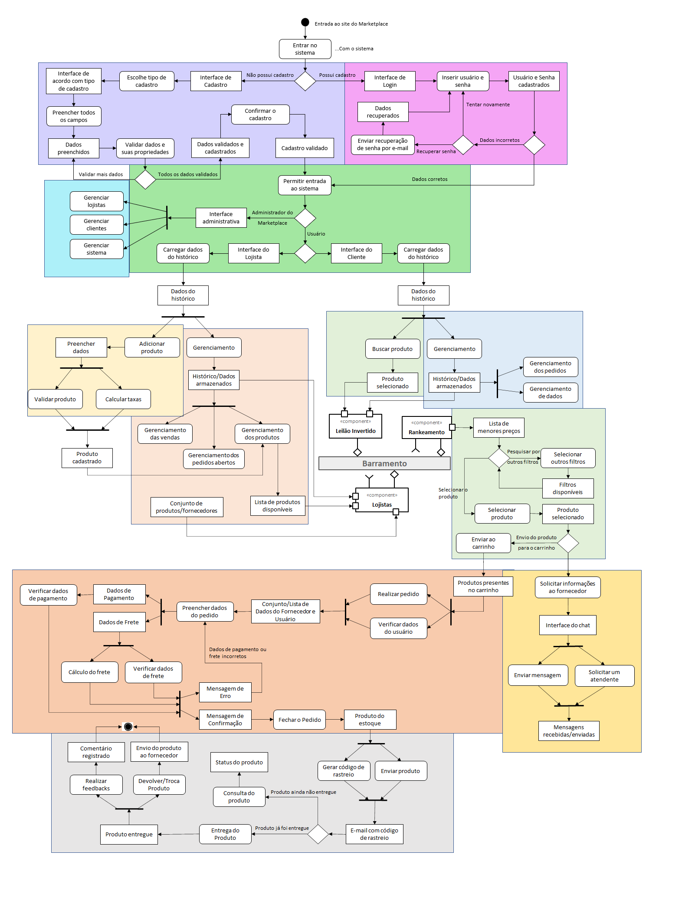

# Detalhamento da interação dos componentes

O componente `Cadastro Usuario` transmite através da interface `IUsuario` as informações do usuário cadastrado.

O componente `Login` recebe através da interface `IUsuario` os dados paraautenticar se um usuário é válido e disponibiliza através da interface`IUsuario` a permissão de acesso.

O componente `PerfilAcesso` recebe através da interface `IUsuario` osdados para determinar o nível de acesso com base na configuração do perfildo usuário previamente cadastrado e fornece a interface `IPerfilAcesso`,direcionando o usuário.
O componente `Cadastro Produto` recebe através da interface`IPerfilAcesso` para determinar com base no perfil de acesso do usuáriologado se ele pode ou não cadastrar um novo produto. Se afirmativo,fornece a interface `IProduto` com base nos dados fornecidos pelo usuáriologado e persiste no banco de dados.

O Componente `Dashboard Administrador` recebe através da interface`IPerfilAcesso` os dados para determinar com base no perfil de acesso dousuário logado, caso seja o perfil ADM a interface `IRelatorio` éfornecida com base nas visualizações destinadas ao seu perfil de acesso.

O Componente `Dashboard Cliente` recebe através da interface `IPerfilAcesso` para determinar com base no perfil de acesso do usuário logado, caso seja o perim CLI a interface `IRelatorio` é fornecida com base nas visualizações destinadas ao seu perfil de acesso.

O Componente `Dashboard Lojista` recebe através da interface `IPerfilAcesso` para determinar com base no perfil de acesso do usuário logado, caso seja o perim LOJ a interface `IRelatorio` é fornecida com base nas visualizações destinadas ao seu perfil de acesso.

O componente `Filtro Produto` recebe através da interface `IPerfilAcesso` para determinar com base no perfil de acesso do usuário logado o tipo de filtro que pode ser realizado e fornece a interface `Item[]`.

O componente `Leilão Invertido` recebe através da interface “`IPerfilAcesso`”, um conjunto de dados do usuário.
- Ao receber o conjunto de dados do usuário, o componente irá transmitirpara o barramento as mensagens de tópico “`leilao/produto/filtro`”, com osdados para a busca do produto solicitado pelo usuário.

O componente `Lojistas` irá buscar o conjunto de dados através dasmensagens de tópico “`leilao/produto/filtro`”.
- Ao receber o conjunto de dados para a busca do produto solicitado pelousuário, o componente irá desenvolver uma lista de fornecedores, a qualserá enviada para o barramento através de mensagens do tópico “`leilaoprodutos`”.

O componente `Rankeamento` irá buscar o conjunto de dados através dasmensagens de tópico “`leilao/produto`”.
- Ao receber o conjunto de dados referente a lista de fornecedores, ocomponente irá transmitir uma lista com os produtos rankeados através dainterface `Produto[]`.

O componente `Checkout` recebe através interface `Item[]`, que representa a lista de produtos, e com base em validações e conversões internas o componente gera o pedido fornecendo a interface `IPedido`.
	
O componente `Acompanhamento` recebe através da interface `IPedido` paravalidação do endereço de entrega através do CEP, recebe também a interface`IChat` para possibilitar ao usuário logado comunicação com o lojista.Possibilitando o rastreio através da interface `IRastreio`.

O componente `Chat` recebe através da interface `IDataProduto` asinformações para estabelecer uma interação entre o fornecedor e o cliente.E envia através da interface “IChat”, as informações para realizar umpedido, caso o fornecedor queira realizar o pedido para o cliente.

# Descrição dos Componentes:

## 1. Componente Cadastro Usuário (Roxo): 
Este componente tem o intuito de verificar se o usuário possui um cadastro registrado no sistema do Marketplace. Se o usuário possuir cadastro, os dados do usuário serão encaminhados para o componente Login. Se o usuário não possuir cadastro, o componente irá encaminhá-lo para realizar um novo cadastro no sistema.
	Para realizar um novo cadastro, deve-se, primeiramente, escolher qual será o tipo de cadastro, ou seja, se será um cadastro administrativo, de lojista ou de cliente. Em seguida, irá abrir uma interface com os campos de autenticação e verificação respectivos a escolha realizada. 
Para ser administrador do sistema, por exemplo, é preciso ter a autorização do owner e um código de identificação para liberar o acesso, além dos outros campos a serem preenchidos. Já para ser lojista do marketplace é preciso de um CNPJ em caso de loja registrada ou de um CPF em caso de ser pessoa física, por exemplo.
Em resumo, cada tipo de cadastro deverá ter todos os seus campos verificados de acordo com a forma de preenchimento estabelecida pelo sistema, e validados para garantir a autenticidade das informações.
Por questão de segurança, todos os usuários deverão escolher uma senha contendo as seguintes orientações: pelo menos uma letra maiúscula, pelo menos uma letra minúscula, pelo menos um número, e pelo menos 8 caracteres. Além disso, o usuário deverá escolher uma pergunta-chave e inserir a resposta correta e a qual irá se recordar no futuro. Esta pergunta-chave seja utilizada caso seja necessário registrar uma nova senha.
Assim que todos os dados forem validados e registrados, uma notificação será enviada através do e-mail cadastrado pelo usuário para confirmar seu acesso, e permitir sua entrada no sistema.

## 2. Componente Login (Rosa):
Os dados do usuário armazenados no sistema serão enviados a este componente para que quando ele inserir seu login (e-mail)  e sua senha, o sistema do marketplace possa confirmar se os códigos de acesso estão corretos, e assim permitir a entrada no sistema. 
Entretanto, caso os dados estejam incorretos, o usuário será notificado que há incompatibilidade entre o código de acesso inserido com o registrado, e pode vir a realizar outras tentativas ou recuperar o acesso através do registro de uma nova senha.
Para recuperar o acesso, o usuário irá ser direcionado a outra interface e nela inserir o e-mail cadastrado no campo solicitado. Caso este e-mail não esteja cadastrado no sistema, uma notificação irá ser apresentada ao usuário. Caso contrário, um link do sistema será enviado ao e-mail com o assunto "recuperação de acesso". O usuário pode inserir a última senha de que se recorde, ou responder a pergunta-chave. Em ambas as opções, se o campo for preenchido corretamente, o sistema do marketplace irá permitir o registro de uma nova senha, a qual será utilizada posteriormente para realizar um novo login.

## 3. Componente Perfil Acesso (Verde):
Após a confirmação de permissão do sistema, este componente irá redirecionar o usuário de acordo com seu perfil, ou seja, se o usuário for administrador, ele irá ser direcionado para a interface de visualização administrativa do sistema, o mesmo ocorre para os perfis de lojista e cliente, ao serem redirecionados às interfaces de seus perfis de cadastro.

## 4. Componente DashBoard Administrador (Azul):
Este componente representa o gerenciamento realizado pelo administrador. 
O administrador tem permissão para gerenciar os lojistas, fornecedores e/ou parceiros, através de seus dados, seus históricos de vendas e de interações com os clientes, a fim de proporcionar aos usuários uma melhor experiência. Dentre as informações disponíveis dos lojistas, pode-se citar  a quantidade de vendas entregues dentro do prazo, média de preços praticados, localização geográfica e alcance da entrega, facilidade na resolução de problemas, entre outras. Estas informações auxiliam os administradores a decidirem quem deve ser mantido e recomendado aos clientes.
Além disso, o administrador auxilia no desenvolvimento e na estabilidade do sistema, promovendo funcionalidades para que os lojistas e os clientes acompanhem seus pedidos em aberto e entregues, gerencie seus perfis, interagem entre si e registrem todas as operações realizadas em um banco de dados para armazenar os dados e possibilitar a auditoria do sistema.
O administrador também é responsável por assegurar a confiabilidade, segurança e privacidade do sistema do marketplace, pois é fundamental que as transações financeiras efetuadas pelo site, assim como os dados pessoais dos usuários estejam seguros e restritos.

## 5. Componente DashBoard Cliente (Azul Claro):
Este componente representa o gerenciamento realizado pelo cliente.
O cliente pode gerenciar seus pedidos em aberto e entregues, seus dados pessoais, como endereço e dados para pagamento, e suas interações com os fornecedores como solicitações de informações, negociações e feedbacks.

## 6. Componente DashBoard Lojista (Laranja Claro):
Este componente representa o gerenciamento realizado pelo lojista.
O lojista, fornecedor e/ou parceiro pode, de modo geral, gerenciar suas vendas, seus produtos e seus pedidos abertos e entregues. Exemplos de informações disponíveis são a quantidade de vendas entregues dentro do prazo, quanto dos valores financeiros que serão repassados de seus produtos, média de preços praticados, localização geográfica e alcance da entrega, facilidade na resolução de problemas, entre outras.
Além disso, ele também poderá acompanhar seus produtos vendidos e entregues, e suas interações com os clientes, como feedbacks e dúvidas relacionadas às informações adicionais ou técnicas do produto, por exemplo.
Já o gerenciamento de produto é fundamental, pois os lojistas são responsáveis pela disponibilização e manutenção das informações dos produtos comercializados, tais como, quantidade em estoque, preços, tamanhos, fotografias, entre outras.

## 7. Componente Cadastro Produto (Amarelo Claro):
Este componente representa o registro de um novo produto através do fornecedor, ou lojista. Para cadastrar um novo produto é preciso assegurar que ele está contido na lista dos produtos permitidos a serem comercializados dentro do marketplace.
Após a seleção e confirmação do tipo de produto, será preciso preencher os campos disponíveis de acordo com a orientação pré-estabelecida através dos comentários de cada um dos campos, como, por exemplo, a imagem deve ser de boa qualidade, os campos de preço aceitarem apenas números, ter um limite de caracteres que podem ser utilizados nos campos de texto, e assim em diante.
O sistema irá calcular as taxas e os valores financeiros que poderão ser repassados ao fornecedor caso o produto tenha a venda bem-sucedida. Após estes critérios, o produto será cadastrado ao sistema, uma notificação será apresentada ao usuário e o produto irá ser adicionado à sua lista de produtos para gerenciar seu desempenho.

## 8. Componente Filtro Produto (Verde Claro):
Este componente permite que o usuário busque pelo produto desejado através da barra de busca da interface. O cliente pode comprar produtos como em uma loja virtual tradicional, porém podendo escolher entre diferentes lojas/fornecedores.
Uma listagem inicial será apresentada ao usuário através do método de "leilão invertido", o qual irá apresentar os produtos mais recomendados ordenados pelo menor preço. O cliente poderá, posteriormente, optar por selecionar um dos produtos para averiguar melhor suas informações ou selecionar um ou mais dos outros filtros disponíveis pelo sistema.
Além do "leilão invertido", o sistema toma como base os históricos do cliente e dos fornecedores do produto solicitado, como localidade para determinar o alcance disponível de entrega, a classificação do produto e do fornecedor, feedbacks apresentados por outros usuários que já compraram este produto, entre outros atributos. Estas informações também estarão disponíveis para que o cliente possa consultar antes de realizar a compra, com o intuito de proporcionar uma melhor experiência.
Assim que o cliente selecionar um ou mais produtos desejados para compra, eles serão armazenados no carrinho de compras, até que o usuário decida realizar e finalizar o pedido, ou excluir os produtos.

## 9. Componente Checkout (Laranja):
Este componente irá buscar os produtos presentes no carrinho para realizar o processo de pedido de compra.
O sistema irá buscar pela lista de produtos, e estruturar o pedido de compra, ao mesmo tempo em que verifica e captura os dados do usuário. O usuário deverá preencher e confirmar todos os campos do pedido.
O sistema irá verificar os dados bancários e os de endereço para garantir, respectivamente, que sejam dados de uma conta bancária válida, e enviem o produto e/ou a cobrança para o endereço correto. Caso os dados estão incorretos ou inválidos, uma mensagem será exibida ao usuário para que ele confirme novamente os dados, ou insira outros.
Quando todos os campos estiverem preenchidos e validados, a confirmação do pedido será exibida na interface do usuário e ainda será enviada ao e-mail cadastrado. Caso o usuário tenha escolhido "boleto" como forma de pagamento, ele poderá optar por abrir o boleto na tela, enviar para o e-mail ou imprimir. O pedido só será confirmado quando o pagamento for realizado e concluído com sucesso dentro do período estimado pelo boleto ou cartão. Caso contrário, o pedido será cancelado.

## 10. Componente Acompanhamento (Cinza):
Este componente é responsável pelo procedimento após a confirmação do pedido.
O pedido será enviado ao fornecedor, o qual deverá retirar o produto do estoque e enviar ao usuário, gerando por meio disto um código de rastreio do pacote para que o cliente possa acompanhar seu novo produto até seu endereço.
O código será enviado para o e-mail do cliente, o qual será notificado de toda e qualquer atualização referente ao status de seu produto. Embora ele ainda possa consultar manualmente o trajeto através do sistema do marketplace.
Assim que o produto for entregue, o cliente receberá no e-mail, alguns dias depois, a opção de registrar seu feedback do fornecedor e do produto no marketplace, como elogios, críticas e/ou sugestões. Este comentário será registrado e armazenado para que outros clientes possam utilizar como referência no momento de sua compra.
Caso o usuário queira devolver ou trocar o produto, ele deverá preencher um formulário justificando o motivo da devolução, para que o fornecedor esteja validando a razão e assim tomar as medidas necessárias. Em caso de discordância entre o fornecedor e o cliente, o administrador do sistema pode e deve interferir e trabalhar como mediador para resolver a situação da melhor maneira.

## 11. Componente Chat (Amarelo):
Este componente representa a interação entre os usuários do marketplace. Em outras palavras, ele possibilita que o cliente tenha uma interface para se comunicar diretamente com o fornecedor ou representante da loja do produto desejado. 
Por meio deste chat, é possível obter respostas a dúvidas técnicas, ou adicionais do produto, solicitar negociações ou descontos especiais, por parcerias ou cupons e até mesmo elogiar, criticar ou sugerir alguma mudança em relação ao atendimento.
O fornecedor por sua vez pode realizar e concluir o pedido do cliente, solicitando seus dados e os preenchendo nos campos correspondente, aplicando descontos ou adicionando novas funcionalidades ao produto, caso seja do desejo do cliente. 

## 12. Componente Leilão Invertido (Barramento):
Este componente irá receber o produto buscado pelo cliente, assim como seu histórico de compras e dados pessoais, como localidade (endereço), pacote escolhido pelo usuário durante o cadastro, ou ao longo do tempo de utilização da plataforma, para que assim ele possa gerar o dado completo de busca e enviar ao barramento.

## 13. Componente Lojistas (Barramento):
Este componente irá receber a lista de produtos e os dados históricos de cada lojista, fornecedor e/ou parceiro. Por meio do produto desejado pelo cliente, o componente irá  listar os fornecedores que possuem o produto e são melhor indicados de acordo com seus dados históricos.
Esta lista de fornecedores será enviado ao barramento contendo o produto, a descrição, o preço e outras informações que ajudaram o cliente a tomar a melhor decisão para ele.

## 14. Componente Rankeamento (Barramento):
Este componente será responsável por ranquear as melhores escolhas de fornecedores e seus produtos e listá-las na interface do usuário. Lembrando de que este ranqueamento se trata da filtragem inicial e comum a todos as buscas realizadas no sistema.
Levando em consideração o procedimento de leilão invertido, o componente irá capturar a lista de fornecedores que possuem o produto, e classificá-las do menor preço ao maior preço. Entretanto, o sistema também irá utilizar como base as informações específicas de uma compra como a forma de pagamento e o endereço de entrega do usuário. Além disso, pode utilizar o histórico dos fornecedores para auxiliar na definição de classes de parceiros/fornecedores diferenciadas, onde parceiros em classes mais altas podem ter vantagens ou prioridade na recomendação, por exemplo.
Em resumo, o ranqueamento irá classificar os produtos do menor ao maior preço, ao mesmo tempo que ele também irá considerar os históricos dos fornecedores, assim como os dados de pagamento e frete do cliente. 
Com isso, este componente possibilita um processo de compra mais eficiente, pois evita o cliente de precisar buscar tão a fundo o produto desejado, o que poderia ocasionar na perda de interesse do produto ou da plataforma. Além de também disponibilizar os produtos mais adequados de acordo com o perfil de cada usuário.


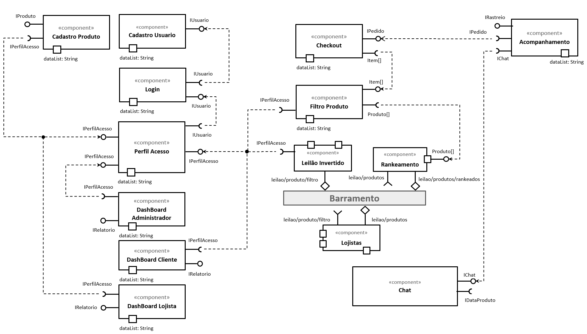

# Componente de Checkout

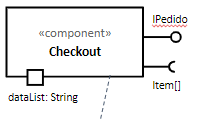

Este componente tem a função de concentrar a lógica do processo de fechamento do pedido, incluindo as sub etapas de cálculo do frete, processamento do pagamento e movimentação do pedido para entrega.

## Interfaces de Checkout

### IPedido

Interface que representa o pedido efetuado no checkout, ela contém todas as informações do pedido, incluindo informações de frete.

|Atributo|Descrição|
|:-:|:-|
|codPedido|Identificador único do pedido|
|codDesconto|Código do cupom de de desconto aplicado|
|descontoAplicado|Dados de desconto gerados por um código de desconto|
|criadoEm|Data de criação do pedido|
|atualizadoEm|Data da última atualização do pedido|
|moeda|Moeda sobre a qual a transação será calculada|
|idCliente|Identificador do cliente que efetuou o pedido|
|listaItens|Lista de itens que compõe o pedido|
|enderecoCobranca|Endereço de cobrança|
|enderecoEntrega|Endereço de entrega|
|linhaFrete|O serviço de frete selecionado original|
|linhaFrete|O serviço de frete com valores originais|
|freteReal|O serviço de frete selecionado calculado c/s desconto|
|origem|Origem do pedido, app_mobile ou app_web|
|subtotal|O valor total do pedido no checkout antes de calcular taxas fretes ou descontos|
|linhaTaxa|Lista de taxas aplicadas ao pedido|
|taxar|Indicador se as taxas serão ou não incluídas ao valor do pedido (cliente paga as taxas)|
|valorTotal|O valor total do pedido após aplicadas taxas, custos de frete, descontos e vale presentes|
|taxaTotal|Total de taxas aplicadas ao pedido|

#### Json Exemplo

```json
{
"codPedido": "b1946ac92492d2347c6235b4d2611184",
"codDesconto": "30_DOLLARS_OFF",
"descontoAplicado": IDesconto(),
"criadoEm": "2008-01-10T11:00:00-05:00",
"atualizadoEm": "2012-08-24T14:02:15-04:00",
"moeda": "BRL",
"idCliente": 1234,
"gift_cards": [ IValePresente() ],
"listaItens": [ IItem() ],
"enderecoCobranca": IEndereco(),
"enderecoEntrega": IEndereco(),
"linhaFrete": IFreteCalc(),
"freteReal": IFreteCalc(),
"origem": "app_mobile",
"subtotal": "398.00",
"linhaTaxa": [ ITaxa() ],
"taxar": false,
"valorTotal": "409.94",
"taxaTotal": "11.94",
}
```  

### ITaxa  
|Atributo|Descrição|
|:-:|:-|
|valor|Valor efetivo da taxa calculada|
|porcentagem|Porcentagem da taxa|
|titulo|Descrição da taxa|

#### Json Exemplo
```json
{
  "valor": "11.94",
  "porcentagem": "0.06",
  "titulo": "State Tax",
}
```

### IItem

Interface para os objetos que compõem os itens do pedido

|Atributo|Descrição|
|:-:|:-|
|codItem|Identificador único do item|
|precoOriginal|Preço original do produto caso esteja em promoção|
|peso|Peso do produto|
|precoLinha|Preço total calculado multiplicando o price pela quantity|
|preco|O preço unitário base para o item|
|codProduto|Identificador do produto para o item|
|quantidade|Quantidade do produto adquirida|
|sku|Código visível do produto no catálogo de produtos|
|taxavel|Identificador se o produto deve ser taxado ou não|
|titulo|Título do item copiado do produto|
|codVariante|Código da variante do produto|
|tituloVariante|Título da variante do produto|
|fabricante|Fabricante do item|

#### Json Exemplo
```json
{
  "codItem": 39072856,
  "precoOriginal": "9.99",
  "peso": "20",
  "precoLinha": "19.99",
  "preco": "19.99",
  "codProduto": 632910392,
  "quantity": "",
  "sku": "IPOD2008GREEN",
  "taxavel": true,
  "titulo": "IPod Nano - 8GB",
  "codVariante": 39072856,
  "tituloVariante": "Green",
  "fabricante": "Apple"
}
```

### IValePresente

Dados de um vale presente que pode ser aplicado ao pedido.

|Atributo|Descrição|
|:-:|:-|
|codValePresente|Identificador do vale presente|
|quantidadeUtilizada|Valor usado do vale presente|
|sulfixo|Últimos caracteres do vale presente para exibição|
|balanco|Valor restante no vale presente após a transação|

#### Json Exemplo
```json
{
  "codValePresente": 1014759463,
  "quantidadeUtilizada": "30.00",
  "balanco": "70.00",
  "sulfixo": "abdr"
}
```

### IDesconto

Interface que define as informações de um desconto aplicado ao item.  

|Atributo|Descrição|
|:-:|:-|
|quantidade|Valor que será descontado do payment_due|
|nomePessoa|Nome da pessoa relacionada ao endereço|
|titulo|Título para categorizar o desconto|
|description|Descrição do desconto|
|valor|Valor usado para efetivamente calcular o desconto|
|tipoValor|Tipo de desconto, percentage ou fixed_amount|
|razaoRecusa|Motivo caso o desconto não possa ser aplicado|
|aplicavel|Indicador se o desconto pode ou não ser aplicado|

#### Json Exemplo
```json
{
  "quantidade": "30.00",
  "titulo": "XYZ Promotion",
  "description": "Promotional item for blackfriday.",
  "valor": "30.00",
  "tipoValor": "fixed_amount",
  "razaoRecusa": null,
  "aplicavel": true,
}
```

### IEndereco

Esta interface representa um endereço, que pode ser usado em cobrança ou entrega.

|Atributo|Descrição|
|:-:|:-|
|logradouro|A rua, logradouro, avenida, etc...|
|cidade|Cidade|
|company|Empresa associada a este endereço (caso aplicável)|
|pais|País|
|nomePessoa|Nome da pessoa relacionada ao endereço|
|telefone|Telefone relacionado ao endereço|
|bairro|Nome do bairro, província ou sub região|
|cep|Código postal (CEP)|
|codPais|Código do País|

#### Json Exemplo
```json
{
  "logradouro": "Chestnut Street 92",
  "cidade": "Louisville",
  "company": null,
  "pais": "United States",
  "nomePessoa": "Bob",
  "telefone": "555-625-1199",
  "bairro": "Kentucky",
  "cep": "40202",
  "codPais": "US"
}
```

### IFreteCalc

Interface que contém as informações de frete calculado para o item.

|Atributo|Descrição|
|:-:|:-|
|codFrete|Identificador global do serviço de frete (transportadora)|
|preco|Custo do frete calculado|
|titulo|Título na tela de checkout|

#### Json Exemplo
```json
{
  "codFrete": "shop-Standard-10.00",
  "preco": "10.00",
  "titulo": "Standard",
}
```

# Componente de Acompanhamento
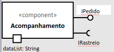<br />

Este componente funciona de forma síncrona e é responsável por fornecer dados sobre o estado da entrega, como interface requerida necessita de um IRastreio e no final provê uma interface de IPedido. Ele é acionado após a confirmação de pagamento do pedido, provendo a possibilidade de acompanhamento do andamento da entrega. 

## Interfaces de Acompanhamento

## IRastreio

Única interface requerida deste componente, é utilizada para que o componente de Acompanhamento inicie suas atividades, os dados contidos por esta interface são transportados no formato JSON, abaixo é possível ver os campos e suas respectivas descrições.

|Atributo|Descrição|
|:-:|:-|
|codRastreio|Código de rastreio do produto, código único|
|codPedido|Código do pedido|
|codCliente|Código do cliente|
|codFornecedor|Código do fornecedor|
|localidade|Posição geográfica do pedido|
|status|Status da entrega. Ex: Em transporte, entregue e etc|

#### Json Exemplo
```json
{
  "codRastreio": 123,
  "codPedido": 456,
  "codCliente": 654,
  "codFornecedor": 1234,
  "Localidade": {
    "Lat": 23°10'45.98"S,
    "Lon": 45°53'12.98"W 
  },
"status": "Entregue"
}
```

# Componente de Chat

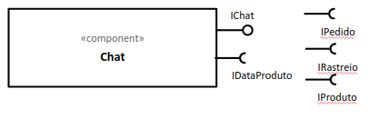<br />
Este componente funciona de forma síncrona e é responsável por fornecer o mecanismo de comunicação entre o consumidor e o fornecedor, como interface requerida necessita de um 

## Interfaces de Chat

### IDataProduto

Interface polimórfica que pode ser referente há um pedido, rastreio ou produto, como interface provida é o IChat responsável pelo tráfego das mensagens, o formato da mensagem obedece à seguinte estrutura:

|Atributo|Descrição|
|:-:|:-|
|resourceCode|Pode ser código do rastreio, pedido ou produto|
|resourceType|O tipo de recurso que a mensagem se refere (rastreio, pedido ou produto)|
|codEmissor|Código do emissor, pode ser o cliente ou fornecedor|
|codReceptor|Código do receptor, pode ser o cliente ou fornecedor|
|mensagem|Mensagem enviada pelo seller ou cliente|

#### Json Exemplo
```json
{
  "resourceCode": 123,
  "resourceType": "Rastreio",
  "codEmissor": 654,
  "codReceptor": 1234,
  "mensagem": "Gostaria de saber como anda meu pedido"
}
```

# Componente Cadastro de Produto
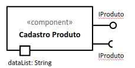<br />

Este componente funciona de forma síncrona e é responsável por fornecer o mecanismo de cadastro de produto por fornecedores, como interfaces tanto requerida quanto provida necessita de um IProduto.

## Interfaces de Cadastro de Produto

### IProduto

Interface responsável por receber e emitir mensagens referente a características do produto.

|Atributo|Descrição|
|:-:|:-|
|codProduto|Código do produto |
|nome|Nome do produto|
|preco|Preço do produto|
|categoria|Categoria do produto|
|disponibilidade|Valor indicativo se o produto está disponível|

#### Json Exemplo
```json
{
  "codProduto": "01",
  "nome": "Playstation 5",
  "preco": "R$ 4.999,99",
  "descricao": "...",
  "categoria": ["eletronico"], 
  "disponibilidade": false
}
```
  
# Componente Filtro de Produto
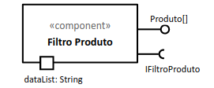<br />

Este componente funciona de forma síncrona e é responsável por fornecer o mecanismo de filtragem de lista produtos disponíveis, como interfaces requerida IFiltroProduto responsável por fornecer os parâmetros necessários para o filtro provendo a interface Produto[] responsável por fornecer uma lista de produtos.

# Componente Leilão

Este componente funciona de maneira assíncrona ao restante do sistema. Como interface requerida, o mesmo necessita apenas de um IFiltroProduto e, ao final de seu processamento, provê uma interface do tipo Produto[]. Ele é utilizado constantemente durante a utilização da feature de busca de produtos realizada pelo usuário. 
Para atingir o funcionamento previsto, foi necessário realizar uma pequena composição de outros 3 componentes. Eles são: Leilão Invertido, Lojistas, e Rankeamento.

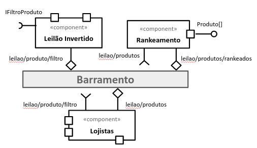<br />

## Interfaces de Leilão

### IFiltroProduto

Esta interface é utilizada como ponto de partida para que o componente Leilão Invertido inicie seu funcionamento. Esta é a única interface requerida do componente. Os dados contidos em IFiltroProduto são transformados em uma mensagem no formato JSON. Os dados são publicados no tópico leilao/produto/filtro.

**Tópico:** leilao/produto/filtro
Este tópico é assinado pelos componentes Leilão Invertido e Lojistas. 

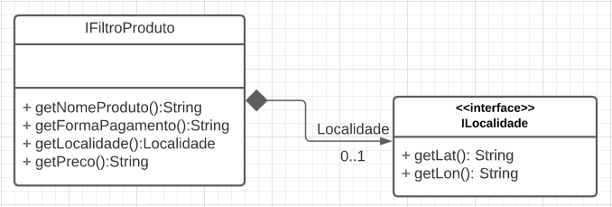<br />

|Atributo|Descrição|
|:-:|:-|
|nomeProduto|Nome pesquisado pelo usuário|
|formaPagamento|String representando a forma de pagamento escolhida no filtro |
|localidade|Pacote contendo os dados de Latitude e longitude|
|preco|Preço pesquisado pelo usuário|

#### Json Exemplo
```json
{
  "NomeProduto": "Playstation 5",
  "FormaPagamento": "Cartao",
  "Localidade": {
    "Lat": "23°10'45.98\"S",
    "Lon": "45°53'12.98\"W" 
  },
  "Preco": "R$ 5.000,00"
}
```

### IProduto

Esta interface é provida pelo componente ao final de seu processamento.Ela é uma lista de produtos que foram qualificados com o objetivo de auxiliar na escolha do usuário. Para que seja possível entregar os dados, um objeto JSON contendo uma lista de produtos é convertida em Produto[]. Os dados que formam esta lista são coletados do tópico leilao/produtos.

**Tópico:** leilao/produtos
Este tópico é assinado pelos componentes Rankeamento e Lojista.

**Tópico:** leilao/produtos/rankeados
	Este tópico é assinado pelo componente Rankeamento. Neste tópico a interface que é utilizada para processamento das mensagens também é o Produto[], sendo diferenciado por conta de ter seus produtos ordenados de forma a especificar para o usuário os melhores produtos.

|Atributo|Descrição|
|:-:|:-|
|codProduto|Identificador unico do produto|
|nome|Nome do produto|
|preco|Preco de venda do produto|
|descricao|Descrição detalhada do produto|
|categoria|Array de categorias do produto|
|disponibilidade|Indicador se o produto está disponível para compra|

#### Json Exemplo
```json
{
  "Produtos": [
    {
      "codProduto": "01",
      "nome": "Playstation 5",
      "preco": "R$ 4.999,99",
      "descricao": "...",
      "categoria": ["eletronico"], 
      "disponibilidade": false
    },
    ...
  ]
}
```

# Componente Dashboard

Componente responsável pela construção dos dashboards. Como interface requerida, é esperado a IUsuario e como interface provida a IRelatorio, representando os dados do usuário e os dados necessários para geração do dashboard, respectivamente.

### IRelatorio
Representa o relatório resultante do gerenciamento dos usuários.
|Atributo|Descrição|
|:-:|:-|
|codRelatorio|Código único de identificação do relatório|
|descRelatorio|Descrição do relatório|
|dadosGrafico|Objeto contendo os dados necessários para composição do gráfico|

#### Json Exemplo
```json
{
   "codRelatorio": 1,
   "descRelatorio": "Descrição do relatório",
   "dadosGrafico": IGrafico()
}
```
 
## Grafico Administrador
 
Perfil de acesso Administrativo. 

### IGraficoAdm *extende* IGrafico
Representa o grafico da dashboard dos administradores.
|Atributo|Descrição|
|:-:|:-|
|tipoGrafico|Tipo do gráfico a ser gerado|
|title|Titulo do gráfico|
|width|Largura do grafico|
|height|Altura do grafico|
|legend|Legenda do grafico|

#### Json Exemplo
```json
{
  "tipoGrafico": "bar",
  "title": "Gráfico de barras",
  "width": 600,
  "height": 400,
  "legend": ["bar1", "bar2"]
}
```

## Grafico Cliente
 
Perfil de acesso Cliente. 

### IGraficoCli *extende* IGrafico
Representa o grafico da dashboard dos usuários.
|Atributo|Descrição|
|:-:|:-|
|tipoGrafico|Tipo do gráfico a ser gerado|
|title|Titulo do gráfico|
|pieHole|Tamanho do grafico|
|color|Cor do segmento de dados|
|legend|Legenda do grafico|

#### Json Exemplo
```json
{
  "tipoGrafico": "pie",
  "title": "Gráfico de barras",
  "pieHole": 0.5,
  "color": "black",
  "legend": ["pie1"]
}
```
 
## Grafico Lojista

Perfil de acesso do Lojista.
 
### IGraficoLoj *extende* IGrafico
Representa o grafico da dashboard dos lojistas.
|Atributo|Descrição|
|:-:|:-|
|tipoGrafico|Tipo do gráfico a ser gerado|
|title|Titulo do gráfico|
|width|Largura do grafico|
|height|Altura do grafico|
|legend|Legenda do grafico|

#### Json Exemplo
```json
{
  "tipoGrafico": "column",
  "title": "Gráfico de colunas",
  "width": 600,
  "height": 400,
  "legend": ["column1"]
}
```

# Sub-Componentes de Acesso
## Componente Cadastro Usuário
Este componente tem como função realizar o cadastramento de lojistas, administradores e clientes do Marketplace. Como interface requerida necessita de um 
IUsuario e no final provê uma interface de IUsuario também. Se ao clicar em cadastrar, e o usuário já tiver cadastro, será redirecionado para o componente de Login, se não possuir o sistema irá direcioná-lo para o devido cadastramento no sistema.

## Componente Login

Esse componente tem como função efetuar o login de lojistas, administradores e clientes do Marketplace. Como interface requerida necessita de um IUsuario e no final provê uma interface de IUsuario também. Ele é acionado quando o usuário é direcionado para a página de autenticação do sistema.

## Componente Perfil Acesso

Este componente tem como função realizar o controle de acesso do usuário no sistema. Ele recebe uma interface IUsuario como entrada, e depois faz a validação do perfil de acesso do mesmo por meio da interface IPerfilAcesso.

## Interfaces de Acesso

### IUsuario
Representa o usuário no sistema, contendo os dados comuns de qualquer usuário do mesmo, como: nome, senha, endereço, email, etc.

|Atributo|Descrição|
|:-:|:-|
|perfil|Tipo de acesso que o usuário tem no sistema.|
|codUsuario|Identificação única do usuário: CPF ou CNPJ.|
|nome|Nome do usuário.|
|senha|Senha criptografada do usuário para obter acesso ao sistema.|
|endereco|Lista de endereços cadastrados pelo usuário.|
|telefone|Telefone de contato do usuário.|
|email|Email cadastrado do usuário no sistema.|
|criado|Quando usuário foi cadastrado no sistema.|
|atualizado|Última atualização no perfil de acesso do usuário|

#### Json Exemplo
```json
{
  "perfil": IPerfilAcesso(),
  "cod_usuario": "123.456.789-10",
  "nome": "João da Silva",
  "senha": "*************",
  "endereco": IEndereco(),
  "telefone": "19 9 9999 9999",
  "email": "joao.silva@email.com",
  "criado": "2020-09-10",
  "atualizado": "2020-09-17"
}
```

### IPerfilAcesso
Representa a especialização do usuário no sistema, podendo representar os seguintes tipos de perfil: cliente, administrador e lojista.

|Atributo|Descrição|
|:-:|:-|
|tipo|Tipo de perfil de acesso: lojista, cliente ou administrador.|
|pedidos|Lista de pedidos do lojista ou cliente.|
|historico|Se tipo lojista: histórico de vendas e visualizações. Se lojista: histórico de compras e pesquisa.|
|produtos|Se tipo lojista: produtos cadastrados pelo lojista no Marketplace.|

#### Json Exemplo
```json
{
  "tipo": "cliente",
  "pedidos": IPedido[],
  "historico": [],
  "produtos": IProduto[]
}

```

# Nível 2

## Diagrama do Nível 2

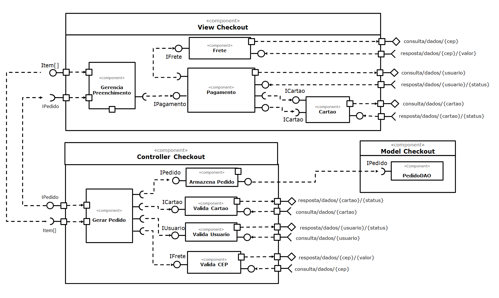

### Detalhamento da interação de componentes

## VIEW CHECKOUT

O componente `Gerencia Preenchimento` recebe através da interface `Item[]`, um conjunto de produtos. <br /> 
 * Ao receber o conjunto de produtos, dispara através da interface `IPagamento`, os dados de pagamento do usuário.
 * Ao final do procedimento de todos os campos, o componente `Gerencia Preenchimento` envia através da interface `IPedido`, um conjunto de dados referentes ao pedido realizado.

O componente `Pagamento` recebe através da interface `IPagamento` um conjunto de dados referentes ao preenchimento do pagamento do usuário.<br /> 
* Por meio da interface `IFrete`, o componente recebe os dados do frete para realizar seu cálculo.
* O componente assina no barramento interno mensagens de tópico “`consulta/dados/{usuario}`”, para consultar os dados do usuário.
* As mensagens de tópico “`resposta/dados/{usuario}/{status}`”, irão retornar ao componente o status do usuário.
* Ao receber os dados referente a escolha de um cartão para pagamento, o componente envia os dados inseridos através da interface `ICartao`, para validar o cartão.
* Ao receber o retorno dos dados através da interface `ICartao`, é possível continuar o processo de pagamento caso o cartão esteja válido. Caso contrário é disparada uma mensagem ao usuário.
* Ao final do processo, o componente irá transmitir os dados de validação pela interface `IPagamento`.

O componente `Cartao` recebe através da interface “`ICartao`” um conjunto de dados referentes aos dados do cartão inserido pelo usuário.<br />
* Ao receber os dados, o componente assina no barramento interno mensagens de tópico “`consulta/dados/{cartao}`”, para consultar os dados do cartão.
* As mensagens de tópico “`resposta/dados/{cartao}/{status}`”, irão retornar ao componente a validação do cartão. 
* Ao final do processo, o componente irá transmitir os dados de validação pela interface `ICartao`.

O componente `Frete` recebe através da interface `IFrete` um conjunto de dados referentes ao preenchimento do endereço do usuário.<br />
* Ao receber os dados referente ao campo “CEP”, o componente assina no barramento interno mensagens de tópico “`consulta/dados/{cep}`”, para consultar o CEP.
* As mensagens de tópico “`resposta/dados/{cep}/{valor}`”, irão retornar ao componente a validação do CEP.
* Ao final do processo, o componente irá transmitir os dados de validação pela interface `IFrete`.

## CONTROLLER CHECKOUT

O componente `Gerar Pedido` recebe através da interface `IPedido`, umconjunto de dados referentes ao pedido realizado.<br />
* Ao receber o conjunto de dados referentes ao pedido realizado, ocomponente os transmite através da interface `IPedido` para o componente`Armazena Pedido`, para registrar o pedido no sistema.
* O componente envia através da interface `Item[]`, um conjunto deprodutos.
	
O componente `Armazena Pedido` recebe através da interface `IPedido`, umconjunto de dados referentes ao pedido realizado.<br />
* Ao receber o conjunto de dados, ele irá transmiti-los através dainterface `IPedido`, para registro do pedido no sistema.

O componente `Valida Cartao` recebe através da interface `ICartao`, umconjunto de dados referente ao cartão.<br />
* Ao receber os dados, o componente irá buscar no barramento interno asmensagens de tópico “`consulta/dados/{cartao}`”, para verificar os dadosdo cartão.
* Após a verificação, o componente irá enviar ao barramento interno asmensagens de tópicos “`resposta/dados/{cartao}/{status}`”, com osresultados.

O componente `Valida Usuario` recebe através da interface `IUsuario`, um conjunto de dados referente ao usuário.<br />
* Ao receber os dados, o componente irá buscar no barramento interno asmensagens de tópico “`consulta/dados/{usuario}`”, para verificar os dadosdo usuário.
* Após a verificação, o componente irá enviar ao barramento interno asmensagens de tópicos “`resposta/dados/{cartao}/{status}`”, com osresultados.

O componente `Valida CEP` recebe através da interface `IFrete`, umconjunto de dados referente ao CEP.<br />
* Ao receber os dados, o componente irá buscar no barramento interno asmensagens de tópico “`consulta/dados/{cep}`”, para verificar os dados dousuário.
* Após a verificação, o componente irá enviar ao barramento interno asmensagens de tópicos “`resposta/dados/{cep}/{valor}`”, com os resultados.


## MODEL CHECKOUT :

O componente `PedidoDAO` recebe através da interface “`IPedido`”, umconjunto de dados referentes ao pedido realizado.<br />
* Ao receber o conjunto de dados referentes ao pedido, ele irá armazenarestes dados no sistema para consultas futuras do pedido.


## Componente `Cartao`

> O componente Cartao oferece uma interface de verificação de dados da bandeira de um determinado cartão. Ele faz parte do pagamento e pode ou não ser utilizado durante o processo.

**Interfaces**
> * ICartao.

As interfaces listadas são detalhadas a seguir:

## Detalhamento das Interfaces

### Interface `ICartao`

> 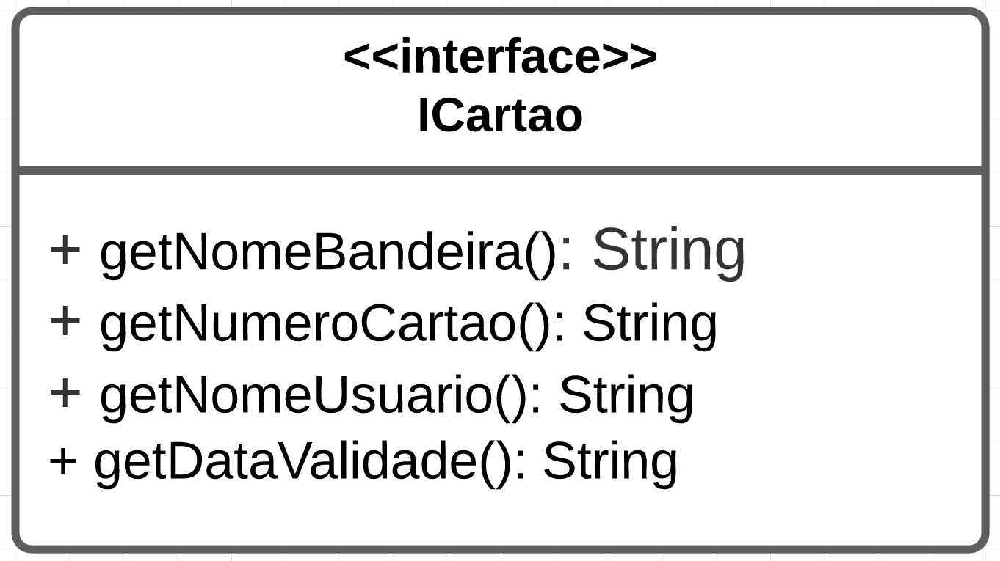

> Esta interface é utilizada basicamente para agrupar os dados fornecidos pelo usuário.

Método | Objetivo
-------| --------
`getNomeBandeira()` | `Recupera o nome da bandeira do cartão utilizado`
`getNumeroCartao()` | `Recupera o número do cartão inserido pelo usuário`
`getNomeUsuario()` | `Recupera o nome preenchido na interface gráfica`
`getDataValidade()` | `Recupera a data de validade do cartão utilizado`

## Componente `Pagamento`

> O componente Pagamento oferece serviços voltados ao uso de boletos ou cartões dentro do sistema. Internamente possui o papel de transitar os dados de usuário com o objetivo de validar os mesmos. Por default, a compra pode ser feita por boleto (lógica interna) entretanto existe uma comunicação com o componente de Cartao no caso do usuário escolher a opção de pagamento por cartão. Para computar o valor total do serviço, o componente requer os dados de Frete, que contém o valor do mesmo.


**Interfaces**
> * IPagamento.
> * IFrete

As interfaces listadas são detalhadas a seguir:

## Detalhamento das Interfaces

### Interface `IPagamento`

> 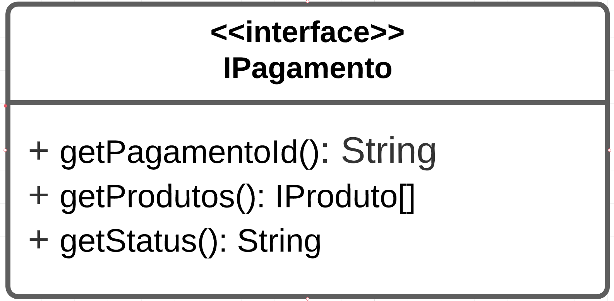

> Utilizado para encapsular os dados referentes ao pagamento que o usuário deve realizar para prosseguir com o pedido.

Método | Objetivo
-------| --------
`getPagamentoId()` | `Utilizado para lincar o ID do pagamentono banco`
`getProdutos()` | `Utilizado para verificar a lsita de produtos daquele pagamento`
`getStatus()` | `Verifica o status atual de pagamento`

### Interface `IFrete`

> Esta interface é utilizada neste componente para que seja possível somar o valor do frete ao valor total do pagamento. Seus campos serão descritos no próximo componente.

<br />

## Componente `Frete`

> O componente de frete tem o objetivo de fornecer ao usuário a transparência de se obter um cálculo do valor de transporte para seus produtos. Para seu funcionamento é necessário apenas o CEP do endereço.


**Interfaces**
> * IFrete

As interfaces listadas são detalhadas a seguir:

## Detalhamento das Interfaces

### Interface `IFrete`

> 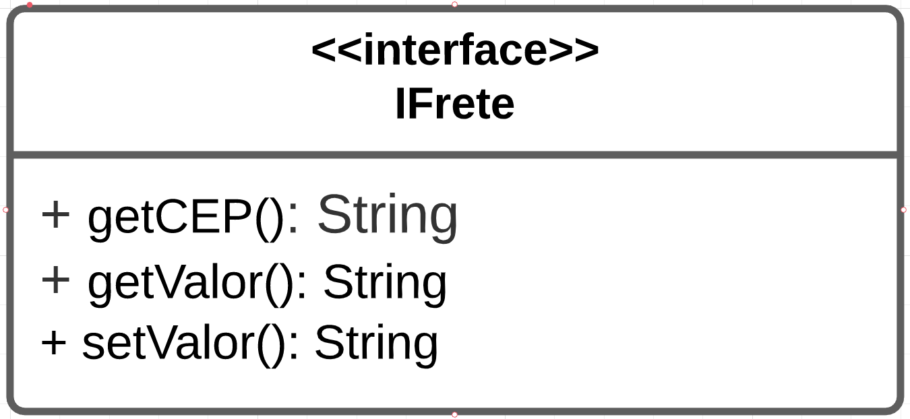

> Esta interface é utilizada para transitar os dados do preço sugerido para transportar o produto até o seu destino.

Método | Objetivo
-------| --------
`getCEP()` | `Recupera o CEP da região escolhida`
`getValor()` | `Recupera o valor total do transporte`
`setValor()` | `Insere o valor do frete`

## Componente `Gerencia Preenchimento`

> Este componente é responsável por iniciar o fluxo de pagamento através da interface gráfica disponibilizada para o usuário. Aqui o usuário poderá preencher os formulários referentes ao seu requerimento de criação de um novo pedido.


**Interfaces**
> * IPagamento
> * IPedido
> * Item[]

As interfaces listadas são detalhadas a seguir:

## Detalhamento das Interfaces

### Interface `Item[]`

> 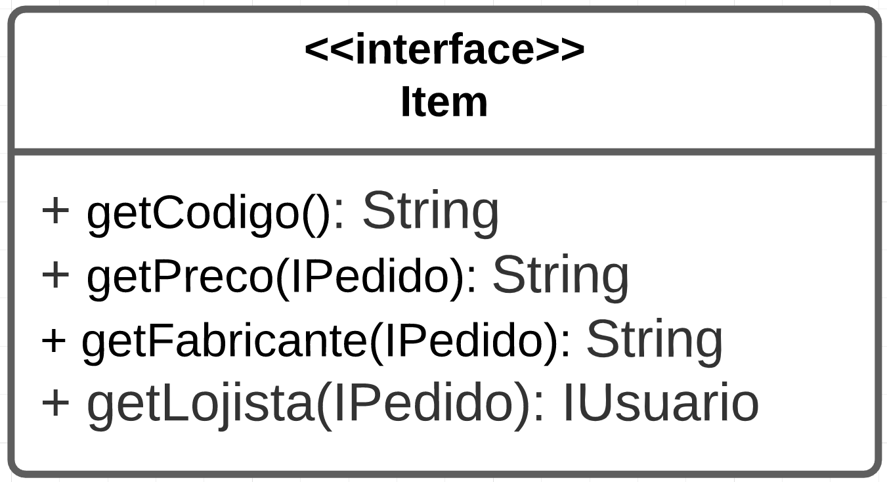

> Esta interface é utilizada para armazenar os itens que o usuário pretende adicionar em seu pedido.

Método | Objetivo
-------| --------
`getCodigo()` | `Recupera o código do produto selecionado`
`getPreco()` | `Recupera o valor do produto`
`getFabricante()` | `Recupera o fabricante original do produto`
`getLojista()` | `Campo para informar o fornecedor do produto`

### Interface `IPagamento`
> A interface de pagamento é requerida neste componente durante o processo de criação do formulário que o usuário deve preencher para realizar seu pedido.

### Interface IPedido
> Esta interface (Já descrita) simboliza o pedido completo para que seja possível mostrar ao usuário.

## Componente `Armazena Pedido`

> O componente Armazena Pedido oferece uma interface de pedido para persistência em banco de dados e ṕosterior consulta do histórico de vendas. Ele se comunica com o componente PedidoDAO representado na camada Model do modelo MVC.

**Interfaces**
> * IPedido

As interfaces listadas são detalhadas a seguir:

## Detalhamento das Interfaces

### Interface `IPedido`

> 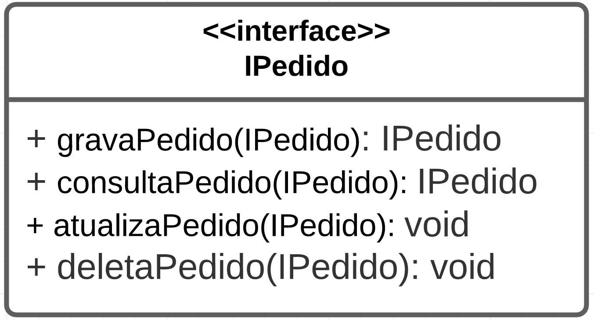

> Utilizado para agrupar os dados relacionados ao pedido fornecidos pelo usuário.

Método | Objetivo
-------| --------
`validaPedido(IPedido)` | `Valida todos os atributos de IPedido seguindo as regras definidas pela área de negócio`
`convertePedido(IPedido)` | `Aplica o padrão Objeto de Transferência de Dados (DTO) para converter o IPedido da camada de Controller para a camada Model`
`gravaPedido(IPedido)` | `Envia o IPedido para a camada Model persistir no banco de dados`

## Componente `PedidoDAO`

> O componente de PedidoDAO tem o objetivo de receber o pedido da camada Controller para persistência no banco de dados. Para seu funcionamento é necessário que o objeto pedido seja fornecido com as devidas validações dos atributos e conversão paro o modelo de dados da camada Model.

**Interfaces**
> * IPedido

As interfaces listadas são detalhadas a seguir:

## Detalhamento das Interfaces

### Interface `IPedido`

> Na camada Model essa interface é utilizada para transitar os dados de pedido entre a camada Controller e a camada Model, nesta etapa os dados do objeto foram transformados pelos métodos validaPedido e convertePedido, responsáveis por garantir que a informação enviada do Controller esteja fiel ao modelo esperado na camada Model.

Método | Objetivo
-------| --------
`validaPedido(IPedido)` | `Valida todos os atributos de IPedido seguindo as regras definidas pela área de negócio`
`convertePedido(IPedido)` | `Aplica o padrão Objeto de Transferência de Dados (DTO) para converter o IPedido da camada de Controller para a camada Model`
`gravaPedido(IPedido)` | `Envia o IPedido para a camada Model persistir no banco de dados`

## Componente `Valida Cartao`

> O componente Valida Cartao oferece uma interface de cartão com as devidas validações aplicadas com o objetivo de assegurar vendas fidedignas ao lojista, minimizando assim possíveis fraudes. Para seu funcionamento é necessário o objeto cartão fornecido pelo usuário.

**Interfaces**
> * ICartao

As interfaces listadas são detalhadas a seguir:

## Detalhamento das Interfaces

### Interface `ICartao`

> No componente Valida Cartao a interface cartão é utilizada para transitar os dados fornecidos pelo usuário para que os mesmos sejam validados por uma Autoridade Certificadora e publica no barramento os dados do cartão validados.

## Componente `Valida Usuario`

> O componente Valida Usuario oferece uma interface de usuário para validação dos dados com o objetivo de assegurar vendas fidedignas ao lojista, minimizando assim possíveis fraudes. Para seu funcionamento é necessário o objeto usuário fornecido pelo cliente.

**Interfaces**
> * IUsuario

As interfaces listadas são detalhadas a seguir:

## Detalhamento das Interfaces

### Interface `IUsuario`

> No componente Valida Usuario a interface usuário é utilizada para transitar os dados fornecidos pelo usuário para que os mesmos sejam validados com base nas regras fornecidos pela área de negócio e publica no barramento os dados do usuário validados.

## Componente `Valida CEP`

> O componente Valida CEP oferece uma interface de frete para validação dos dados relacionados ao local de entrega com o objetivo de assegurar vendas fidedignas ao lojista, minimizando assim possíveis fraudes. Para seu funcionamento é necessário o CEP.

**Interfaces**
> * IFrete

As interfaces listadas são detalhadas a seguir:

## Detalhamento das Interfaces

### Interface `IFrete`

> No componente Valida CEP a interface frete é utilizada para transitar o CEP fornecido pelo usuário para que o mesmo seja validado e publica no barramento os endereço validado.

## Componente `Gerar Pedido`

> Este componente é responsável por iniciar o fluxo de geração do pedido através da lista de produtos disponibilizada pela camada View. Com base na lista de produtos o componente inicia execuções assíncronas para os componentes: Valida Usuario, Valida Cartao, Valida CEP e Armazena Pedido culminando na criação do pedido com todas as validações necessárias.

**Interfaces**
> * IPedido
> * Item[]
> * ICartao
> * IUsuario
> * IFrete

As interfaces listadas são detalhadas a seguir:

## Detalhamento das Interfaces

### Interface `IPedido`

Esta interface (Já descrita) simboliza o pedido completo para que seja possível mostrar ao usuário.

### Interface `Item[]` 
Esta interface é utilizada para armazenar os itens que o usuário pretende adicionar em seu pedido.

### Interface `ICartao` 
Esta interface (Já descrita) simboliza os dados do cartão validados por uma Autoridade Certificadora.

### Interface `IUsuario`  
Esta interface (Já descrita) simboliza os dados do usuário validados com base nas regras definidas pela área de negócio.

### Interface `IFrete` 
Esta interface (Já descrita) simboliza o endereço validado através do CEP.

# Multiplas Interfaces

Para ilustrar o processo de multiplas interfaces a equipe optou por diagramar o fluxo de utilização do componente de Checkout.
Para realizar os processos de compra, a forma de comunicação da view com o controller foi feita toda de forma assíncrona, 
através de comunicação via barramento. 
Desta forma, a view não precisa conhecer todas as interfaces de comunicação requeridas pelo controller.
Isto faz com que a camada de visualização não fique fortemente acoplada à camada de controller.
Outro ponto importante a se considerar é que, no processo de funcionamento do componente (descrito acima)
não existe interação da camada de visualização com a camada de dados. Desta forma existe apenas um fraco acoplamento
entre View e controller e nenhum acoplamento entre View e Model.

Tendo isto em mente, para realizar a troca de interface com o objetivo de evolução e/ou portabilidade
é necessário apenas que a camada de visualização tenha conhecimento das interfaces de Pedido e de Itens.
O restante do processo de validação é todo realizado através de comunicações via JSON:


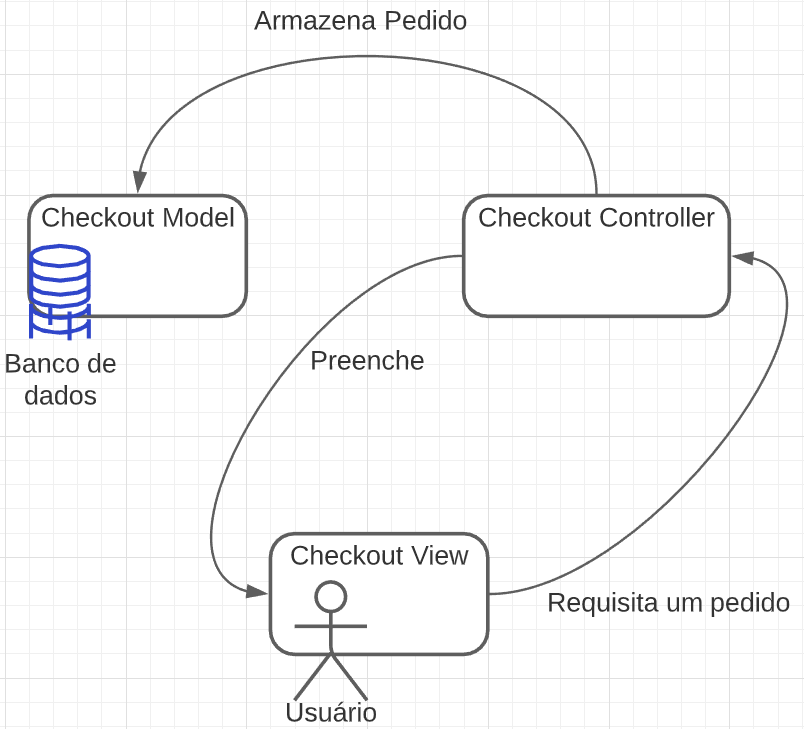

# Resources Extras


[Diagrama Detalhado](resources/diagrama_detalhado.pptx)

[Diagrama Nível 1](resources/diagrama_nivel_1.pptx)

[Diagrama de Sub Componentes](resources/laboratorio_sub_componentes.pptx)


